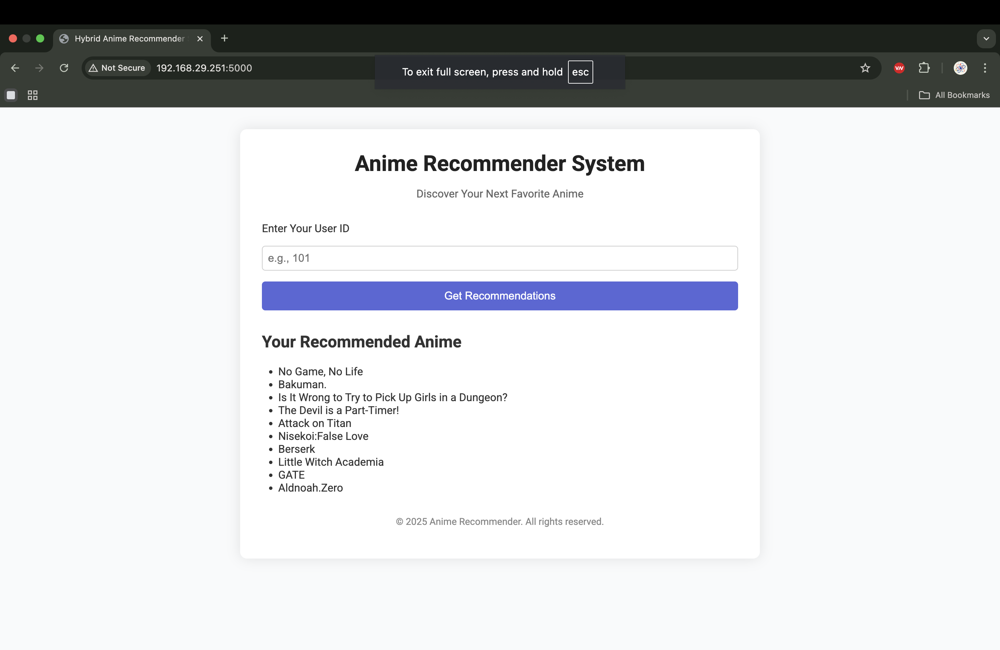

## create a virtual environments 

```bash
python -m venv venv

``` 

## Activate a virual environment

```bash
source venv/bin/activate


``` 


## Run setup.py file using
```bash

pip install -e .

``` 



## use 

###  set GOOGLE_APPLICAT


gcloud auth application-default login


## DVC steps 
dvc add artifacts/raw
dvc add artifacts/processed/
dvc add artifacts/model
dvc add artifacts/model_checkpoint/
dvc add artifacts/weights/

## add to GCP Bucket 
dvc remote add -d myremote gs://my-dvc-bucket-9999

dvc status 

dvc push
dvc pull
 

## for docker 
docker build -t jenkins-dind . 

## for checking :- 
 docker images

## for running of container
docker run -d --name jenkins-dind ^


docker build -t jenkins-ml .
docker run -d -p 8080:8080 -p 50000:50000 --name jenkins-ml jenkins-ml
docker run -d -p 8080:8080 -p 50000:50000 -v $(pwd)/ml_project:/home/jenkins/ml_project --name jenkins-ml jenkins-ml

Access Jenkins at http://localhost:8080


in cd custom-jenkins:
use:- docker build -t jenkins-dind . 
and 

Note: my-jenkins-> container name 

docker run -d \
  --name my-jenkins \
  -p 8080:8080 -p 50000:50000 \
  -v jenkins_home:/var/jenkins_home \
  -v /var/run/docker.sock:/var/run/docker.sock \
  jenkins-dind     


alphanumeric key:- 
ede9cb669749c39cdbc3d3452971504e3dc53fe1182790628945c2eb1448a118

use: docker logs my-jenkins 
pass:- 2be350b2250c404291b600079da1ae07

user:- 
docker exec -u root -it my-jenkins 

apt update -y
apt install -y python3
python3 --version
ln -s /usr/bin/python3 /usr/bin/python
python --version
apt install -y python3-pip
apt install -y python3-venv
exit

docker restart my-jenkins 


Jenkins Script 
checkout scmGit(branches: [[name: '*/main']], extensions: [], userRemoteConfigs: [[credentialsId: 'github-token', url: 'https://github.com/drpreetyrai/MLOPS_RecommederSystem.git']])


googel cloud registry
kubenetes engine api 
kubernetes engine/clusters

container registry 
kubernetes engine 

